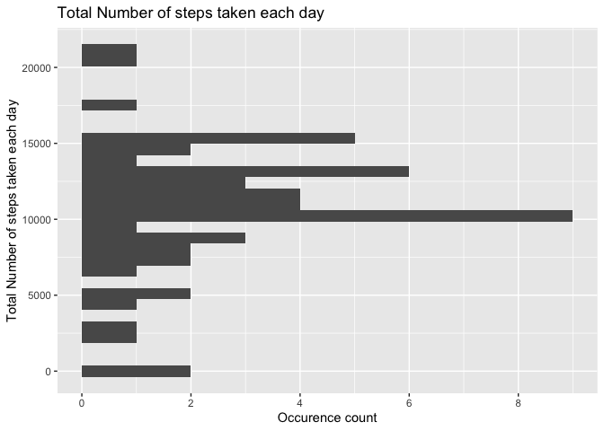
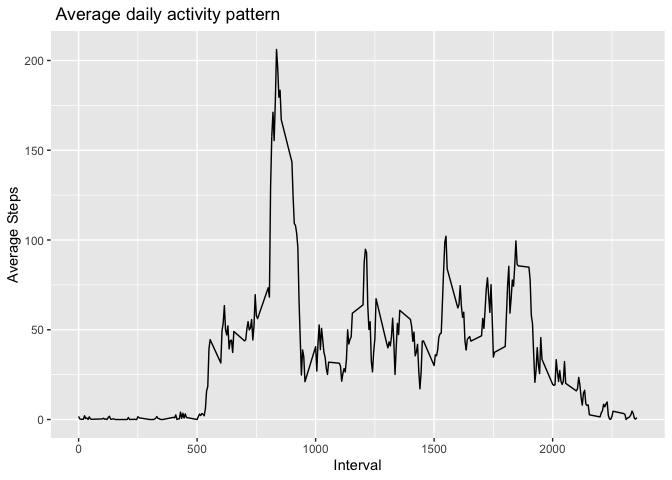
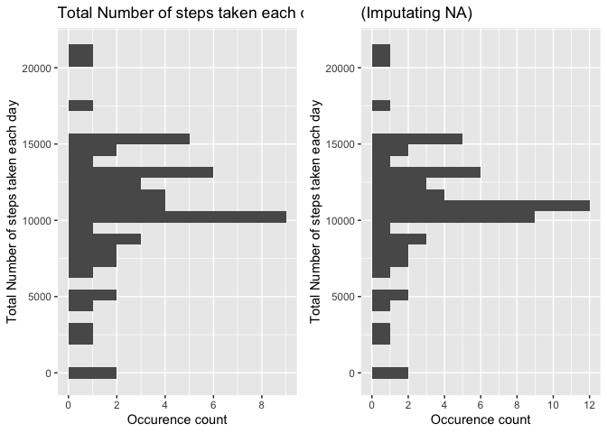
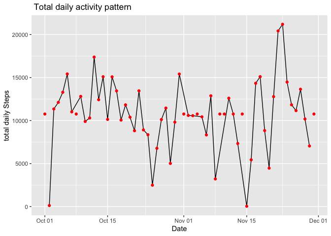
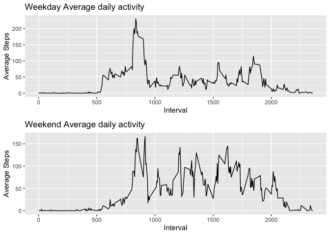

## Preparation of Environment & Packages

```
## 
## Attaching package: 'dplyr'
```

```
## The following objects are masked from 'package:stats':
## 
##     filter, lag
```

```
## The following objects are masked from 'package:base':
## 
##     intersect, setdiff, setequal, union
```

```
## 
## Attaching package: 'lubridate'
```

```
## The following objects are masked from 'package:base':
## 
##     date, intersect, setdiff, union
```

```
## 
## Attaching package: 'gridExtra'
```

```
## The following object is masked from 'package:dplyr':
## 
##     combine
```

```
## [1] "/Users/macrazbunare/Documents/GitHub/RRProject1"
```

## Loading and preprocessing the data

###Load the data

```r
## read outcome data
raw_data <- read.csv("activity.csv", na.strings = "NA", stringsAsFactors = FALSE)

str(raw_data)
```

```
## 'data.frame':	17568 obs. of  3 variables:
##  $ steps   : int  NA NA NA NA NA NA NA NA NA NA ...
##  $ date    : chr  "2012-10-01" "2012-10-01" "2012-10-01" "2012-10-01" ...
##  $ interval: int  0 5 10 15 20 25 30 35 40 45 ...
```

```r
summary( raw_data )
```

```
##      steps            date              interval     
##  Min.   :  0.00   Length:17568       Min.   :   0.0  
##  1st Qu.:  0.00   Class :character   1st Qu.: 588.8  
##  Median :  0.00   Mode  :character   Median :1177.5  
##  Mean   : 37.38                      Mean   :1177.5  
##  3rd Qu.: 12.00                      3rd Qu.:1766.2  
##  Max.   :806.00                      Max.   :2355.0  
##  NA's   :2304
```

### Process/transform the data

The strategy adopted here is essentially to remove lines containing NA.

```r
# filter out records with NA
data <- filter(raw_data, !is.na(steps))

# Convert date strings to time_stamps
data <- mutate(data, datetime=as.POSIXct(date) )  #Convert strings as Lubridate datestime format

str(data)
```

```
## 'data.frame':	15264 obs. of  4 variables:
##  $ steps   : int  0 0 0 0 0 0 0 0 0 0 ...
##  $ date    : chr  "2012-10-02" "2012-10-02" "2012-10-02" "2012-10-02" ...
##  $ interval: int  0 5 10 15 20 25 30 35 40 45 ...
##  $ datetime: POSIXct, format: "2012-10-02" "2012-10-02" ...
```

```r
summary( data ) ## 15264 = 17568 - 2304 : validate we removes the correct number of lines
```

```
##      steps            date              interval     
##  Min.   :  0.00   Length:15264       Min.   :   0.0  
##  1st Qu.:  0.00   Class :character   1st Qu.: 588.8  
##  Median :  0.00   Mode  :character   Median :1177.5  
##  Mean   : 37.38                      Mean   :1177.5  
##  3rd Qu.: 12.00                      3rd Qu.:1766.2  
##  Max.   :806.00                      Max.   :2355.0  
##     datetime                  
##  Min.   :2012-10-02 00:00:00  
##  1st Qu.:2012-10-16 00:00:00  
##  Median :2012-10-29 00:00:00  
##  Mean   :2012-10-30 17:37:21  
##  3rd Qu.:2012-11-16 00:00:00  
##  Max.   :2012-11-29 00:00:00
```

## What is mean total number of steps taken per day?

###Calculate the total number of steps taken per day


```r
# create dataframe for total number of steps per day 
df <- mutate(data, date_col = as.POSIXct(datetime)) %>%  #convert strings to POSIX Date for
  group_by(date_col) %>%
  summarize(totalSteps = sum(steps))
```

```
## `summarise()` ungrouping output (override with `.groups` argument)
```

```r
data_histogram <- data.frame(x = factor(df$date_col), y = df$totalSteps)
ghist1 <- ggplot( data_histogram , aes( y= y) ) +
  geom_histogram() +
  ggtitle("Total Number of steps taken each day") +
  ylab("Total Number of steps taken each day" ) +
  xlab("Occurence count") +
  xlim(c(0,16)) +
  scale_x_continuous(breaks = seq(0,16,2) ) 
```

```
## Scale for 'x' is already present. Adding another scale for 'x', which will
## replace the existing scale.
```

```r
plot(ghist1)
```

```
## `stat_bin()` using `bins = 30`. Pick better value with `binwidth`.
```

<!-- -->
###Calculate the  mean and median of the total number of steps taken per day


```r
# create dataframe for the mean and median of the total number of steps taken per day
mean <-   summarize(df, mean = mean(totalSteps))
median <- summarize(df, mean = median(totalSteps))  

sprintf("mean = %f , median = %f ", mean, median)
```

```
## [1] "mean = 10766.188679 , median = 10765.000000 "
```


## What is the average daily activity pattern?


```r
# create dataframe for total number of steps per day 
dfIntervals <- mutate(data, date_col = as.POSIXct(datetime)) %>%
  group_by(interval) %>%
  summarize(averageSteps = mean(steps))
```

```
## `summarise()` ungrouping output (override with `.groups` argument)
```

```r
g1 <- ggplot( dfIntervals , aes(x=interval,y=averageSteps) ) +
  geom_line() +
  ggtitle(" Average daily activity pattern ") +
  ylab("Average Steps" ) +
  xlab(  "Interval") 
plot(g1)
```

<!-- -->

```r
maxAvg <- dfIntervals[which.max(dfIntervals$averageSteps),]
sprintf("The interval %i contains the maximum average (%f)", maxAvg$interval, maxAvg$averageSteps )
```

```
## [1] "The interval 835 contains the maximum average (206.169811)"
```

## Imputing missing values
###Number of missing values

```r
raw_data %>%
  select(everything()) %>%  # replace to your needs
  summarise_all(funs(sum(is.na(.))))
```

```
## Warning: `funs()` is deprecated as of dplyr 0.8.0.
## Please use a list of either functions or lambdas: 
## 
##   # Simple named list: 
##   list(mean = mean, median = median)
## 
##   # Auto named with `tibble::lst()`: 
##   tibble::lst(mean, median)
## 
##   # Using lambdas
##   list(~ mean(., trim = .2), ~ median(., na.rm = TRUE))
## This warning is displayed once every 8 hours.
## Call `lifecycle::last_warnings()` to see where this warning was generated.
```

```
##   steps date interval
## 1  2304    0        0
```

```r
filledData <- raw_data %>% 
  mutate(datetime=as.POSIXct(date) ) %>%
  group_by(interval) %>%
  mutate(steps= ifelse(is.na(steps), mean(steps, na.rm=TRUE), steps))

summary(filledData)
```

```
##      steps            date              interval     
##  Min.   :  0.00   Length:17568       Min.   :   0.0  
##  1st Qu.:  0.00   Class :character   1st Qu.: 588.8  
##  Median :  0.00   Mode  :character   Median :1177.5  
##  Mean   : 37.38                      Mean   :1177.5  
##  3rd Qu.: 27.00                      3rd Qu.:1766.2  
##  Max.   :806.00                      Max.   :2355.0  
##     datetime                  
##  Min.   :2012-10-01 00:00:00  
##  1st Qu.:2012-10-16 00:00:00  
##  Median :2012-10-31 00:00:00  
##  Mean   :2012-10-31 00:25:34  
##  3rd Qu.:2012-11-15 00:00:00  
##  Max.   :2012-11-30 00:00:00
```

```r
df2 <- mutate(filledData, date_col = as.POSIXct(datetime)) %>%  #convert strings to POSIX Date for
  group_by(date_col) %>%
  summarize(totalSteps = sum(steps))
```

```
## `summarise()` ungrouping output (override with `.groups` argument)
```

```r
data_histogram2 <- data.frame(x = factor(df2$date_col), y = df2$totalSteps)
ghist2 <- ggplot( data_histogram2 , aes( y= y) ) +
  geom_histogram() +
  ggtitle("(Imputating NA)") +
  ylab("Total Number of steps taken each day" ) +
  xlab("Occurence count") +
  xlim(c(0,16)) +
  scale_x_continuous(breaks = seq(0,16,2) ) 
```

```
## Scale for 'x' is already present. Adding another scale for 'x', which will
## replace the existing scale.
```

```r
grid.arrange(ghist1, ghist2,ncol=2)
```

```
## `stat_bin()` using `bins = 30`. Pick better value with `binwidth`.
```

```
## `stat_bin()` using `bins = 30`. Pick better value with `binwidth`.
```

<!-- -->

```r
# create dataframe for the mean and median of the total number of steps taken per day
mean <-   summarize(df2, mean = mean(totalSteps))
median <- summarize(df2, mean = median(totalSteps))  

sprintf("mean = %f , median = %f ", mean, median)
```

```
## [1] "mean = 10766.188679 , median = 10766.188679 "
```

###Impact on dailynimber of steps 


```r
g1 <- ggplot( df , aes(x=date_col,y=totalSteps), color="blue" ) +
  geom_line() +
  geom_point(data=df2,aes(x=date_col,y=totalSteps), color="red") +
  ggtitle(" Total daily activity pattern ") +
  ylab("total daily Steps" ) +
  xlab(  "Date") 
plot(g1)
```

<!-- -->

The impact of imputing missing data on the estimates of the total daily number of steps
 is shown on the previous time serie.  The red points correspond to the data in which we 
 assigned the average of the interval to the missing fields.  The black line correspond 
 to the dataset in which we deleted the lines containing NA.  Red points which are not 
 superimposed with the black line are the result of the imputation of missing values. 

## Are there differences in activity patterns between weekdays and weekends?


```r
# create dataframe for total number of steps per day 

weekData <- filledData %>% 
  mutate(datetime=as.POSIXct(date) ) %>%
  mutate(day = weekdays(datetime)) %>%
  mutate(weekday = as.factor(ifelse(wday(datetime,week_start=1)< 6, "weekday", "weekend"))) 
 


dfWeekdayIntervals <- weekData %>% filter(weekday == "weekday" ) %>%
  group_by(interval) %>%
  summarise(averageSteps=mean(steps))
```

```
## `summarise()` ungrouping output (override with `.groups` argument)
```

```r
dfWeekEndIntervals <- weekData %>% filter( weekday == "weekend" ) %>%
  group_by(interval) %>%
  summarise(averageSteps=mean(steps))
```

```
## `summarise()` ungrouping output (override with `.groups` argument)
```

```r
g1 <- ggplot( dfWeekdayIntervals , aes(x=interval,y=averageSteps) ) +
  geom_line() +
  ggtitle("Weekday Average daily activity") +
  ylab("Average Steps" ) +
  xlab(  "Interval") 

g2 <- ggplot( dfWeekEndIntervals , aes(x=interval,y=averageSteps) ) +
  geom_line() +
  ggtitle("Weekend Average daily activity") +
  ylab("Average Steps" ) +
  xlab(  "Interval") 


grid.arrange(g1, g2,ncol=1)
```

<!-- -->

```r
maxAvg <- dfIntervals[which.max(dfIntervals$averageSteps),]
sprintf("The interval %i contains the maximum average (%f)", maxAvg$interval, maxAvg$averageSteps )
```

```
## [1] "The interval 835 contains the maximum average (206.169811)"
```
